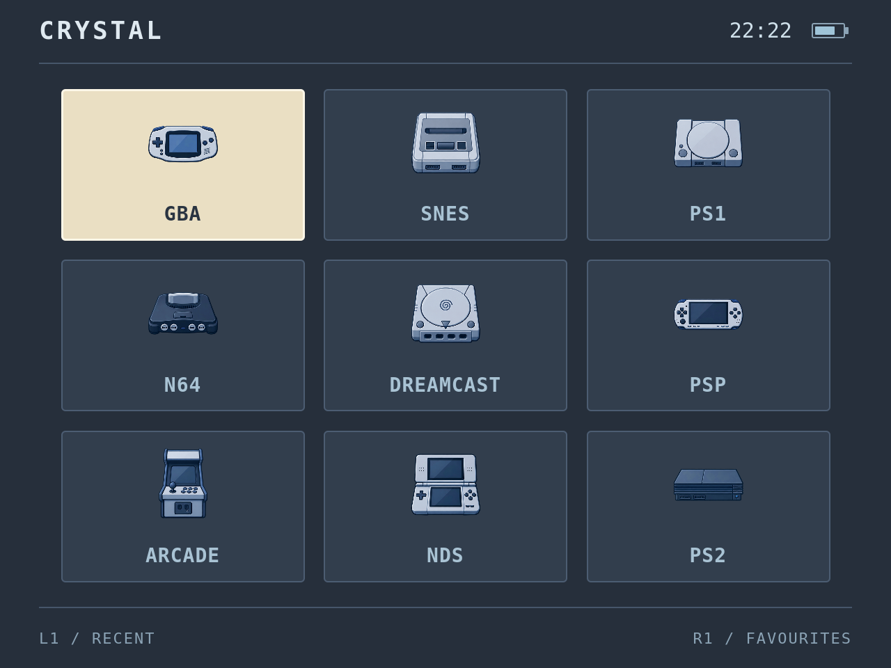

# Crystal Nova — Pegasus Theme (Phase 1.6)

Custom Pegasus Frontend theme for the **Retroid Pocket Nova**.



Visual source of truth: `reference/approved-crystal-nova-ui.png` — the approved
Crystal Nova handheld dashboard. That image is the contract; the theme matches
it, it does not reinterpret it.

Style: bespoke retro firmware / old-LCD feel. Muted icy blue and cream on a
dark blue-grey background, pixel-clean DejaVu Sans Mono typography, minimal
clutter. No neon gradients, no glassmorphism, no floating cards.

## Target

- **Device:** Retroid Pocket Nova (Android)
- **Resolution:** 1280×960, 4:3
- **Frontend:** Pegasus Frontend
- **Status:** Phase 1.6 — HOME / SYSTEM SELECTION screen with the final
  production icon pack (30 icons, centralized alias resolver)

## Layout

```
crystal-nova-pegasus-theme/
├── theme.cfg                  Pegasus theme manifest
├── theme.qml                  Root: screen state, key handling, layout
├── components/
│   ├── Header.qml             CRYSTAL title, live clock, battery, divider
│   ├── BatteryIndicator.qml   Real api.device battery rendering
│   ├── SystemGrid.qml         3×3 grid, D-pad nav, paging, row wrap
│   ├── SystemTile.qml         Tile: production icon via IconResolver, text fallback
│   ├── IconResolver.js       Centralized shortName → icon resolver + alias map
│   ├── FooterHints.qml        L1 / RECENT · page indicator · R1 / FAVOURITES
│   └── Toast.qml              Brief overlay notice
├── screens/
│   └── SystemPlaceholder.qml  Temporary system screen (interaction proof)
├── assets/
│   ├── icons/                 30 production icons, 512×512 RGBA (see below)
│   ├── fonts/                 DejaVu Sans Mono + Bold
│   └── backgrounds/           (reserved)
├── reference/
│   └── approved-crystal-nova-ui.png   Approved visual reference — do not redesign
├── preview/
│   ├── preview.py             PySide6 harness: mock Pegasus api, 1280×960 renders
│   └── phase1-home-1280x960.png       Current Phase 1 implementation screenshot
├── tests/
│   ├── test_preview.py        18-check render + state suite
│   └── test_icon_resolver.py  Resolver logic (QJSEngine) + PNG validation
├── tools/
│   └── splice_icons.py        Production icon builder: sheet → 512×512 icons
├── LICENSES/
│   └── DejaVu-LICENCE.txt     Bitstream Vera licence for the bundled fonts
└── README.md
```

## Controls

| Input | Action |
|---|---|
| D-pad / arrows | Move selection (wraps within row, pages at grid edges) |
| A / Enter | Open system (placeholder screen in Phase 1) |
| B / Esc on system screen | Back to home |
| B / Esc on home | **Not consumed** — Pegasus opens its own menu |
| L1 / PageUp | RECENT toast (Phase 2 stub) |
| R1 / PageDown | FAVOURITES toast (Phase 2 stub) |

The last selected system persists across restarts via
`api.memory` key `crystalNova.lastSystem`.

## Pegasus APIs / properties used

- `api.collections` — `count`, `get(index)`; roles `name`, `shortName`. Drives the grid.
- `api.keys` — `isAccept(event)`, `isCancel(event)`, `isPrevPage(event)`,
  `isNextPage(event)`. Directional input (D-pad/arrows) is handled with
  standard QML `event.key === Qt.Key_Left/Right/Up/Down` — Pegasus does not
  expose `api.keys.isLeft/isRight/isUp/isDown` for theme use.
- `api.device` — `batteryPercent` (0..1), `batteryCharging` (bool).
  Unknown/absent battery renders an empty outline; nothing is faked.
- `api.memory` — `get`, `has`, `set`, `unset`. Selection persistence.

QML imports are versioned (`QtQuick 2.12`) for the Qt 5.x builds Pegasus ships.
No Qt 6-only syntax is used.

## Installing on Android Pegasus

1. Copy the **entire `crystal-nova-pegasus-theme` folder** to the device.
2. Place it in Pegasus's themes directory:
   - `/storage/emulated/0/pegasus-frontend/themes/crystal-nova-pegasus-theme/`
3. In Pegasus, open Settings → Theme and select **Crystal Nova**.
4. On desktop builds, F5 reloads the theme after edits.

The theme reads `theme.cfg` at the folder root; `theme.qml` is the entry point.

## Per-system artwork (Phase 1.6 production pack)

`assets/icons/` holds 30 production icons, one per file, each a 512×512
RGBA PNG with genuine alpha transparency. The artwork is optically centered
(alpha-centroid) at ~78% of the canvas and reads on both the dark tile and
the cream selected tile — **there are no separate `_selected` files**.
Selection is communicated by the cream tile itself, per the approved
reference.

Icons render in a 200×132 box (`PreserveAspectFit`) — roughly 0.6 of the
tile width, per the approved reference.

### Alias resolver

Pegasus collection shortNames don't always match icon filenames, so every
lookup goes through `components/IconResolver.js`:

- normalizes input: lowercase, diacritics folded, spaces/hyphens/
  underscores stripped
- maps common alternative names (`game-boy` → `gb`, `megadrive` →
  `genesis`, `tg16` → `pcengine`, `32x` → `sega32x`, `psx` → `ps1`,
  `favorites` → `favourites`, `history` → `recent`, `library` →
  `allgames`, `windows`/`steam` → `pc`, …)
- unknown names resolve to `""` so the tile falls back to its text glyph
  instead of a broken image
- `iconFor(shortName, selected)` returns the same artwork in both states;
  `SELECTED_VARIANTS` is the hook for alternate selected art later

Current inventory: gba, snes, ps1, n64, dreamcast, psp, gb, gbc, nes,
genesis, segacd, sega32x, saturn, pcengine, arcade, nds, 3ds, wii, ps2,
gamecube, vita, wiiu, switch, pc, allgames, recent, favourites, more,
pokemon, collections.

### Building icons from a supplier sheet

`tools/splice_icons.py <sheet.png> <outdir>` extracts the 3×2 supplier
sheet into normalized icons: connected-component detection on the alpha
channel (stray pixels discarded), crop on visible alpha bounds, small
consistent transparent margin, longest side scaled to 400px, optical
centering via the alpha centroid. Source pixels are only resampled once —
no sharpening, recoloring, or tracing. Set the module's `ORDER` list to
the sheet's six names (top row left-to-right, then bottom row).

## What has been tested (PySide6 harness)

`python3 tests/test_preview.py` — 18 checks, all passing at 1280×960:

Render (screenshot valid at 1280×960): initial 3×3 grid, moved selection,
row wrap, 18-collection second page, system entry/exit, L1/R1 toasts,
battery charging / low / unknown, empty state.

State (QML state asserted after scripted input): selected index after
directional input (5 after Right,Right,Down; wrap lands on 2), page 1 after
paging through 18 collections, `screen == "system"` after Accept,
`screen == "home"` after Cancel, and selection restored from
`api.memory` (`--restore psp` → index 5).

`python3 tests/test_icon_resolver.py` — loads the real
`components/IconResolver.js` in a QJSEngine and verifies it directly:

- 79 resolve cases: canonical shortNames, every documented alias, unknown
  names falling back to `""`, and selected/unselected returning identical
  artwork
- icon inventory: exactly the 30 production files, no `_selected.png`
  files remaining
- PNG validation: every icon is 512×512 RGBA with genuine alpha
  transparency and visible non-transparent pixels

The harness (`preview/preview.py`) mocks the verified Pegasus api surface
(ObjectListModel roles, `api.keys`, `api.device`, `api.memory`) and injects
scripted key sequences via QTest.

## What has NOT been validated yet

- **Real Pegasus runtime.** All verification so far is the PySide6/QML
  preview harness. On-device Pegasus validation on the Nova is the next step.
- Real collection data (names, shortNames, counts) from an actual library.
- Real battery/charging behavior on hardware.
- The exact Android themes directory path on the Nova (see install notes).
- Controller mapping on the Nova (D-pad/L1/R1/A/B → Pegasus key events).

## Known stubs (Phase 2)

- `screens/SystemPlaceholder.qml` — interaction proof only, not the real
  game-library view.
- L1/RECENT and R1/FAVOURITES show toast notices; no real functionality.
- No settings screen, no game grid, no detail views yet.
- Utility icons (allgames, recent, favourites, more, pokemon, collections)
  are integrated and available, but no fake utility tiles are injected
  into the live collection model — real tiles come from `api.collections`
  only. Wiring those behaviors is Phase 2.

## Test harness setup

```sh
python3 -m venv ~/workspace/.venv-qml
~/workspace/.venv-qml/bin/pip install PySide6
~/workspace/.venv-qml/bin/python preview/preview.py --out shot.png \
    [--n 0|9|18] [--battery 0.73] [--charging] [--nobattery] \
    [--keys "Right,Right,Down,Return,Escape"] \
    [--restore SHORTNAME] [--print-state]
```

`--keys` accepts: Up Down Left Right Return Escape PageUp PageDown.
`--restore` pre-seeds `api.memory` so the selection-restore path runs.
`--print-state` prints `screen`, `selectedIndex`, `page` for tests.
