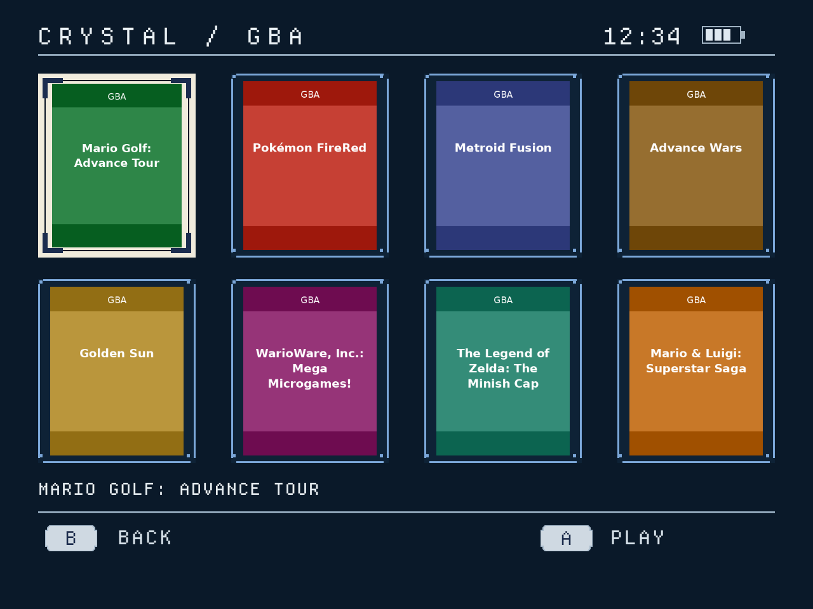

# Crystal Nova — Pegasus Theme (Phase 2)

Custom Pegasus Frontend theme for the **Retroid Pocket Nova**.



Phase 2 adds the real game-library screen: HOME → SYSTEM → GAME → EMULATOR.
The Phase 1.7 home screen is locked production UI and is unchanged.

Visual source of truth: `reference/approved-crystal-nova-ui.png` — the approved
Crystal Nova handheld dashboard. That image is the contract; the theme matches
it, it does not reinterpret it.

Style: bespoke retro firmware / old-LCD feel. Muted icy blue and cream on a
very dark navy background, pixel-clean Departure Mono typography, minimal
clutter. No neon gradients, no glassmorphism, no floating cards.

## Target

- **Device:** Retroid Pocket Nova (Android)
- **Resolution:** 1280×960, 4:3
- **Frontend:** Pegasus Frontend
- **Status:** Phase 1.7 — hero-perfect production polish. Every geometric and
  typographic value measured from the approved reference and centralized in
  `components/CrystalTheme.js`; Departure Mono firmware typeface; hero-matched
  header, segmented battery, open-corner tile frames with registration dots,
  cream selected tile with viewfinder brackets, stepped keycaps, and a
  display-name resolver (GBA, PS2, PSP, GAMECUBE, PC ENGINE, …).

## Layout

```
crystal-nova-pegasus-theme/
├── theme.cfg                  Pegasus theme manifest
├── theme.qml                  Root: screen state, key handling, layout
├── components/
│   ├── Header.qml             CRYSTAL title, live clock, battery, divider
│   ├── BatteryIndicator.qml   Real api.device battery rendering (segmented)
│   ├── SystemGrid.qml         3×3 grid at hero-measured geometry, D-pad nav, paging
│   ├── SystemTile.qml         Tile: production icon via IconResolver, text fallback
│   ├── TileFrame.qml          Unselected frame: open corners + registration dots
│   ├── SelectedMarks.qml      Selected tile: dark viewfinder corner brackets
│   ├── Keycap.qml             Footer keycap: stepped pixel corners, L1 / R1
│   ├── IconResolver.js       Centralized shortName → icon resolver + alias map
│   ├── CrystalTheme.js       Central palette, geometry, display-name resolver
│   ├── FooterHints.qml        Keycap + RECENT · page indicator · keycap + FAVOURITES
│   ├── GameTile.qml           Box-art tile: dark frame, cream selection
│   ├── GameGrid.qml           4×2 paged grid, D-pad navigation
│   ├── GameFallbackArt.qml    No-art fallback card (abbr + title + icon)
│   ├── LibraryFooter.qml      [B] BACK · page indicator · [A] PLAY
│   └── Toast.qml              Brief overlay notice
├── screens/
│   └── GameLibrary.qml        Per-system game library (replaces Phase 1 stub)
├── assets/
│   ├── icons/                 30 production icons, 512×512 RGBA (see below)
│   └── backgrounds/           (reserved)
├── fonts/
│   ├── DepartureMono-Regular.otf   Pixel firmware typeface (SIL OFL 1.1)
│   └── OFL.txt                     Licence for the bundled font
├── reference/
│   └── approved-crystal-nova-ui.png   Approved visual reference — do not redesign
├── preview/
│   ├── preview.py             PySide6 harness: mock Pegasus api, 1280×960 renders
│   └── phase1-home-1280x960.png       Phase 1 home screenshot (locked)
│   ├── phase2-gba-library.png         GBA library, Mario Golf selected
│   ├── phase2-gba-selected.png        GBA library, Zelda selected
│   ├── phase2-ps2-library.png         PS2 library, TOCA selected
│   ├── phase2-page2.png               10-game library, page 2
│   ├── phase2-missing-art.png         Missing-art fallback card
│   └── phase2-empty-library.png       Empty-collection state
├── tests/
│   ├── test_preview.py        18-check render + state suite
│   ├── test_icon_resolver.py  Resolver logic (QJSEngine) + PNG validation
│   └── test_crystal_theme.py  Display names, geometry, palette, component inventory
├── tools/
│   └── splice_icons.py        Production icon builder: sheet → 512×512 icons
└── README.md
```

## Controls

| Input | Action |
|---|---|
| D-pad / arrows | Move selection (wraps within row, pages at grid edges) |
| A / Enter on home | Open the system's game library |
| A / Enter on a game | Launch via the real Pegasus `game.launch()` |
| B / Esc on system screen | Back to home |
| B / Esc on home | **Not consumed** — Pegasus opens its own menu |
| L1 / PageUp | RECENT toast (Phase 3 stub) |
| R1 / PageDown | FAVOURITES toast (Phase 3 stub) |

The last selected system persists across restarts via
`api.memory` key `crystalNova.lastSystem`. Before launching, the theme
stores `crystalNova.lastScreen = "system"` and
`crystalNova.lastGame` (the game index); Pegasus reloads the theme after
a game exits, and the theme restores the library with the game selection
intact.

## Phase 2: game library

Pressing A on a system tile opens `screens/GameLibrary.qml`, a 4×2
box-art grid driven by the real `collection.games` model — no demo
content in production.

- Artwork: `game.assets.boxFront`, falling back to `game.assets.poster`,
  then to a polished Crystal fallback card (system abbreviation + title
  + production system icon). Never a broken-image icon. Images load
  asynchronously; only the current page of 8 is instantiated.
- Selected cover: warm cream outer frame, dark inner edge, viewfinder
  corner brackets, 90ms colour response only. No zoom/bounce/glow.
- Header becomes `CRYSTAL / GBA` (header architecture unchanged).
- Footer: `[B] BACK` left, `[A] PLAY` right, quiet `n / m` page indicator
  centred (only when more than one page). Empty collections hide PLAY.
- D-pad crosses page boundaries; navigation never lands on an invalid
  slot. Zero/one/partial-page libraries are handled.
- Empty collection: `NO GAMES FOUND` / `ADD GAMES TO THIS COLLECTION`.
- Launch: `game.launch()` — Pegasus owns emulator selection via its
  metadata; the theme only invokes the call.

New components: `components/GameGrid.qml`, `components/GameTile.qml`,
`components/GameFallbackArt.qml`, `components/LibraryFooter.qml`;
library geometry is centralized in `components/CrystalTheme.js`
(`lib*` constants) the same way Phase 1.7 was measured.

## Pegasus APIs / properties used

- `api.collections` — `count`, `get(index)`; roles `name`, `shortName`. Drives the grid.
- `collection.games` — item model: `count`, `get(index)`.
- Game objects — `title`, `assets.boxFront`, `assets.poster`, and the
  callable `launch()` (the real Pegasus launch mechanism; shows
  Pegasus' own file selector when a game has multiple launchable files).
- `api.keys` — `isAccept(event)`, `isCancel(event)`, `isPrevPage(event)`,
  `isNextPage(event)`. Directional input (D-pad/arrows) is handled with
  standard QML `event.key === Qt.Key_Left/Right/Up/Down` — Pegasus does not
  expose `api.keys.isLeft/isRight/isUp/isDown` for theme use.
- `api.device` — `batteryPercent` (0..1), `batteryCharging` (bool).
  Unknown/absent battery renders an empty outline; nothing is faked.
- `api.memory` — `get`, `has`, `set`, `unset`. Selection persistence.

QML imports are versioned (`QtQuick 2.12`) for the Qt 5.x builds Pegasus ships.
No Qt 6-only syntax is used.

## Installing on Android Pegasus

1. Copy the **entire `crystal-nova-pegasus-theme` folder** to the device.
2. Place it in Pegasus's themes directory:
   - `/storage/emulated/0/pegasus-frontend/themes/crystal-nova-pegasus-theme/`
3. In Pegasus, open Settings → Theme and select **Crystal Nova**.
4. On desktop builds, F5 reloads the theme after edits.

The theme reads `theme.cfg` at the folder root; `theme.qml` is the entry point.

## Per-system artwork (Phase 1.6 production pack)

`assets/icons/` holds 30 production icons, one per file, each a 512×512
RGBA PNG with genuine alpha transparency. The artwork is optically centered
(alpha-centroid) at ~78% of the canvas and reads on both the dark tile and
the cream selected tile — **there are no separate `_selected` files**.
Selection is communicated by the cream tile itself, per the approved
reference.

Icons render in a 200×132 box (`PreserveAspectFit`) — roughly 0.6 of the
tile width, per the approved reference.

### Alias resolver

Pegasus collection shortNames don't always match icon filenames, so every
lookup goes through `components/IconResolver.js`:

- normalizes input: lowercase, diacritics folded, spaces/hyphens/
  underscores stripped
- maps common alternative names (`game-boy` → `gb`, `megadrive` →
  `genesis`, `tg16` → `pcengine`, `32x` → `sega32x`, `psx` → `ps1`,
  `favorites` → `favourites`, `history` → `recent`, `library` →
  `allgames`, `windows`/`steam` → `pc`, …)
- unknown names resolve to `""` so the tile falls back to its text glyph
  instead of a broken image
- `iconFor(shortName, selected)` returns the same artwork in both states;
  `SELECTED_VARIANTS` is the hook for alternate selected art later

Current inventory: gba, snes, ps1, n64, dreamcast, psp, gb, gbc, nes,
genesis, segacd, sega32x, saturn, pcengine, arcade, nds, 3ds, wii, ps2,
gamecube, vita, wiiu, switch, pc, allgames, recent, favourites, more,
pokemon, collections.

### Building icons from a supplier sheet

`tools/splice_icons.py <sheet.png> <outdir>` extracts the 3×2 supplier
sheet into normalized icons: connected-component detection on the alpha
channel (stray pixels discarded), crop on visible alpha bounds, small
consistent transparent margin, longest side scaled to 400px, optical
centering via the alpha centroid. Source pixels are only resampled once —
no sharpening, recoloring, or tracing. Set the module's `ORDER` list to
the sheet's six names (top row left-to-right, then bottom row).

## What has been tested (PySide6 harness)

`python3 tests/test_preview.py` — 18 checks, all passing at 1280×960:

Render (screenshot valid at 1280×960): initial 3×3 grid, moved selection,
row wrap, 18-collection second page, system entry/exit, L1/R1 toasts,
battery charging / low / unknown, empty state.

State (QML state asserted after scripted input): selected index after
directional input (5 after Right,Right,Down; wrap lands on 2), page 1 after
paging through 18 collections, `screen == "system"` after Accept,
`screen == "home"` after Cancel, and selection restored from
`api.memory` (`--restore psp` → index 5).

`python3 tests/test_icon_resolver.py` — loads the real
`components/IconResolver.js` in a QJSEngine and verifies it directly:

- 79 resolve cases: canonical shortNames, every documented alias, unknown
  names falling back to `""`, and selected/unselected returning identical
  artwork
- icon inventory: exactly the 30 production files, no `_selected.png`
  files remaining
- PNG validation: every icon is 512×512 RGBA with genuine alpha
  transparency and visible non-transparent pixels

`python3 tests/test_crystal_theme.py` — loads the real
`components/CrystalTheme.js` in a QJSEngine and verifies it directly:

- display-name resolver: 30+ cases mapping raw Pegasus names to the short
  intentional labels the hero uses (GBA, SNES, PS1, N64, DREAMCAST, PSP,
  ARCADE, NDS, PS2, GAMECUBE, PC ENGINE, …), including long-name fallback
  when shortName is empty
- geometry: canvas 1280×960, all nine tiles inside the canvas without
  overlap, dividers and keycaps placed sanely
- palette: every named color a valid `#rrggbb`
- inventory: Keycap/TileFrame/SelectedMarks components, the Departure Mono
  OTF, and its OFL licence all present

The harness (`preview/preview.py`) mocks the verified Pegasus api surface
(ObjectListModel roles, `api.keys`, `api.device`, `api.memory`) and injects
scripted key sequences via QTest. `--clock "12:34"` pins the header clock
for deterministic screenshots (production runtime is untouched).

## Phase 1.7 production values

All measured from the approved hero at 1280×960; centralized in
`components/CrystalTheme.js`.

**Typeface:** Departure Mono Regular (SIL Open Font License 1.1, Helena
Zhang), bundled in `fonts/`. Title/clock 36px, footer 30px, tile labels
26px bold.

**Palette:** background `#0a1929`, tile fill `#0e2236`, tile frame
`#7ba7d9`, cream `#f0ebdc`, cream ink `#1b2c4e`, primary ink `#e9f1f6`,
divider `#8fa5b8`, keycap fill `#cfd9e2`.

**Geometry:** margin 60; header 92 (divider y85); grid origin (61,119),
tiles 360×210, column pitch 371, row pitch 226; footer divider y806,
keycaps 82×41 at y828.

**Details:** unselected tiles use open corners (3px frame segments stop
8px short, 5×5 registration dot in each gap); the selected cream tile
carries four dark viewfinder brackets (8px arms, 32px long, 7px inset);
footer keycaps have stepped pixel corners; the battery is segmented.

`python3 tests/test_library.py` — 31 checks, all passing at 1280×960
(Phase 2):

State (QML state asserted after scripted input): library entry from HOME
with the correct collection (`gba`, 8 games, `MARIO GOLF: ADVANCE TOUR`
titled), Right/Left/Up/Down navigation, row-edge crossing, edge holds,
next/previous page across the boundary on a 10-game library, partial
final page, one-game and empty collections, missing-artwork fallback,
long-title elision, B returning home with the home selection intact,
home selection restored from `api.memory`, library + game index restored
when Pegasus reloads after a game, PS2 library (`TOCA RACE DRIVER 3`
first), and A invoking the real mocked `game.launch()` for the selected
game (not the first).

Render (screenshot valid at 1280×960): GBA library, selected game, PS2
library, page 2, missing-art fallback, empty state, long title.

`python3 tests/test_physical_media.py` — 64 node-driver assertions plus
static architecture guards (no QML runtime needed):

Logic (`components/PhysicalMedia/MediaTemplates.js`, driven under node):
exactly two platform families (`gba`, `ps2` — everything else keeps the
flat library), inspect view cycles (GBA front/back; PS2
front/spine/back/open with wraparound), artwork slot fallback chains
(label/disc/case faces), generated-face helpers (spine text, abbr), and
template geometry sanity.

Guards: no `gba`/`ps2` literals outside `MediaTemplates.js`; new QML uses
only existing `CrystalTheme.js` tokens; no 3D imports; no Socket
references; no new audio subsystem; launch still flows through
`GameLibrary.launchCurrent`; brace balance on new/modified QML.

See `docs/PHYSICAL_MEDIA.md` for the architecture, controller mapping,
and the real-Nova verification list.

## What has NOT been validated yet

- **Real Pegasus runtime, especially game launching.** All verification
  so far is the PySide6/QML preview harness. On-device Pegasus validation
  on the Nova — including pressing A on Mario Golf: Advance Tour (GBA →
  RetroArch/mGBA) and TOCA Race Driver 3 (PS2 → NetherSX2 Classic 3668)
  — is the next step. `game.launch()` is the documented Pegasus launch
  mechanism (verified against pegasus-frontend.org/docs/themes/api/),
  but real-device launch success is NOT claimed until tested on hardware.
- Real collection data (names, shortNames, counts) from an actual library.
- Real battery/charging behavior on hardware.
- The exact Android themes directory path on the Nova (see install notes).
- Controller mapping on the Nova (D-pad/L1/R1/A/B → Pegasus key events).

## Known stubs (Phase 3)

- L1/RECENT and R1/FAVOURITES show toast notices; no real functionality.
- No settings screen, no game detail views, no search, no scraping UI.
- Utility icons (allgames, recent, favourites, more, pokemon, collections)
  are integrated and available, but no fake utility tiles are injected
  into the live collection model — real tiles come from `api.collections`
  only.

## Test harness setup

```sh
python3 -m venv ~/workspace/.venv-qml
~/workspace/.venv-qml/bin/pip install PySide6
~/workspace/.venv-qml/bin/python preview/preview.py --out shot.png \
    [--n 0|9|18] [--battery 0.73] [--charging] [--nobattery] \
    [--keys "Right,Right,Down,Return,Escape"] \
    [--restore SHORTNAME] [--print-state]
```

`--keys` accepts: Up Down Left Right Return Escape PageUp PageDown.
`--restore` pre-seeds `api.memory` so the selection-restore path runs.
`--print-state` prints `screen`, `selectedIndex`, `page` for tests.

## Version marker (Crystal Nova Manager)

`crystal-version.json` at the repo root is the machine-readable release
marker consumed by the Crystal Nova Manager Android updater:

```json
{"version":"2.0.0","commit":"8a86a06bdd5f1845f8b02bf66fa65e769e733fac","channel":"stable"}
```

- `version` — semantic version of the stable cut.
- `commit` — the theme-content baseline this version describes (the last
  verified-good theme commit before the marker itself was added; the
  commit that adds/bumps the marker is the release cut).
- `channel` — `stable` (only channel shipped; `beta` is architected
  in the updater but not exposed).

The updater treats the GitHub API commit SHA for the production branch
as authoritative for "latest"; the marker's `commit` is a fallback for
theme folders installed by hand. Release process: bump `version`,
commit the marker, push — the resulting commit becomes the new stable.
